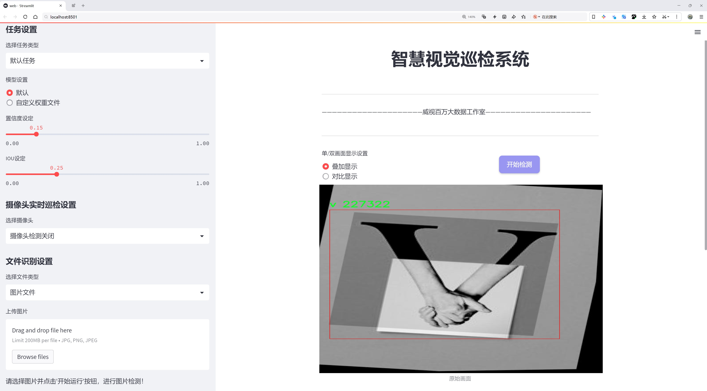
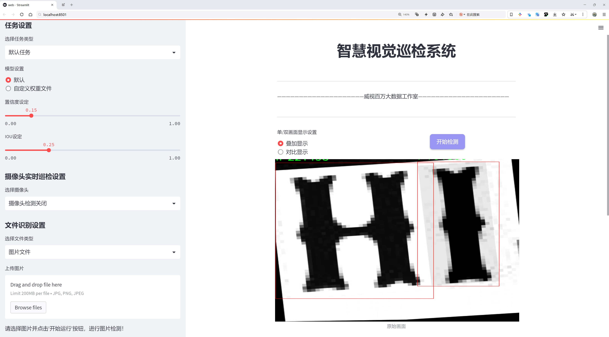
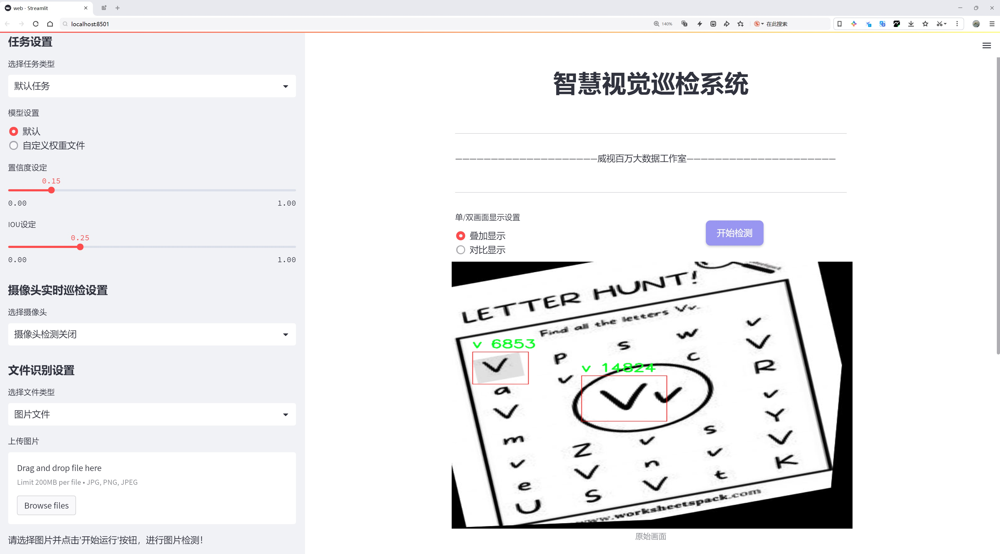
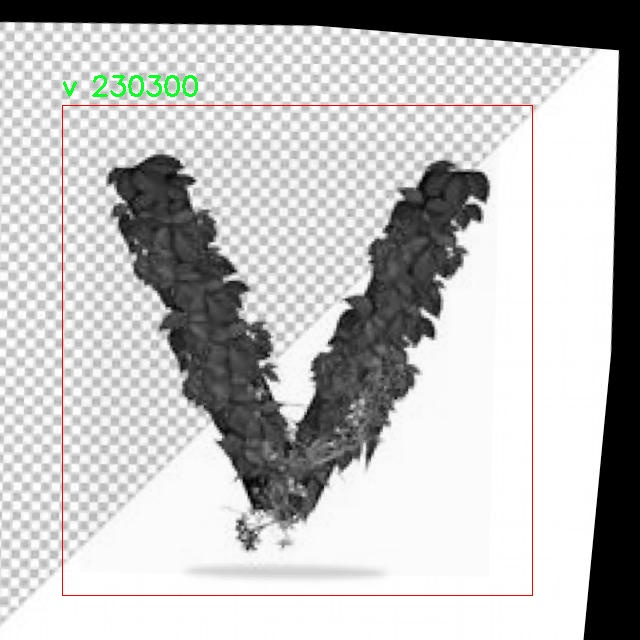
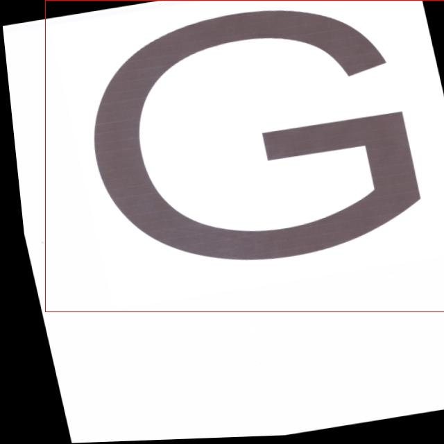
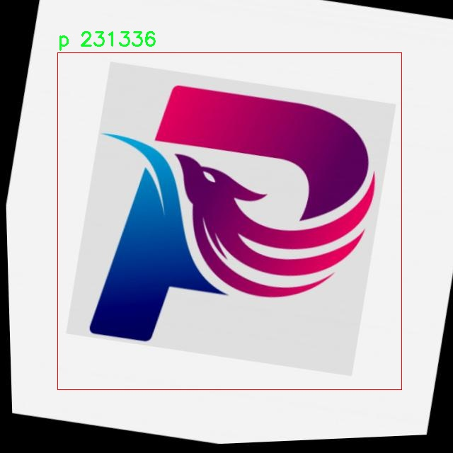
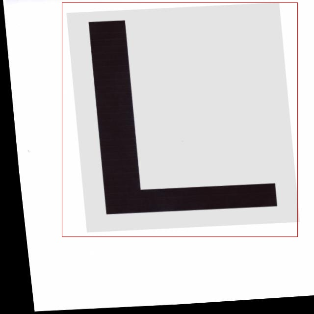
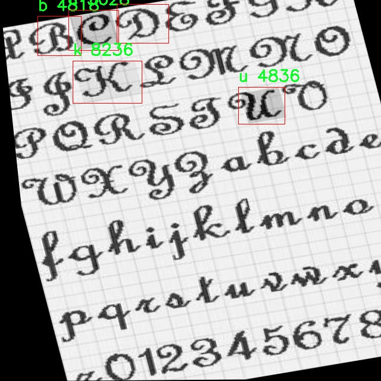

# 字母识别检测系统源码分享
 # [一条龙教学YOLOV8标注好的数据集一键训练_70+全套改进创新点发刊_Web前端展示]

### 1.研究背景与意义

项目参考[AAAI Association for the Advancement of Artificial Intelligence](https://gitee.com/qunmasj/projects)

研究背景与意义

在当今信息化和数字化迅速发展的时代，字母识别技术在众多领域中扮演着越来越重要的角色。随着人工智能和深度学习技术的不断进步，尤其是计算机视觉领域的快速发展，字母识别系统的应用场景也日益广泛。无论是在教育、文档处理、图像搜索，还是在自动驾驶、智能监控等领域，字母识别技术都能够有效提升信息处理的效率和准确性。因此，开发高效、准确的字母识别系统具有重要的理论意义和实际应用价值。

本研究旨在基于改进的YOLOv8模型，构建一个高效的字母识别系统。YOLO（You Only Look Once）系列模型因其优越的实时性和准确性而受到广泛关注。YOLOv8作为该系列的最新版本，结合了更先进的网络结构和训练策略，具备了更强的特征提取能力和更快的推理速度。然而，尽管YOLOv8在物体检测任务中表现出色，但在字母识别这一特定任务中，仍然存在一些挑战，如小字母的识别精度、复杂背景下的干扰等。因此，通过对YOLOv8模型进行改进，以适应字母识别的特定需求，具有重要的研究意义。

在本研究中，我们使用了一个包含4058张图像的字母数据集，涵盖了26个字母类别（从a到z）。该数据集的多样性和丰富性为模型的训练提供了良好的基础。通过对这些图像进行预处理和增强，我们能够有效提升模型的泛化能力和鲁棒性。此外，字母识别系统的设计不仅仅是一个技术问题，更是一个涉及人机交互、用户体验等多方面的综合性问题。因此，在系统设计过程中，我们将充分考虑用户的实际需求，力求构建一个既高效又易于使用的字母识别系统。

本研究的意义还在于推动字母识别技术在教育领域的应用。随着在线教育和自学平台的普及，字母识别技术可以为学习者提供实时反馈，帮助他们更好地掌握字母的发音和书写。此外，在语言学习、儿童教育等领域，字母识别系统能够为教师和学生提供有力的支持，提升学习效果。

综上所述，基于改进YOLOv8的字母识别系统的研究，不仅能够提升字母识别的准确性和效率，还将推动相关技术在多个领域的应用。通过深入探讨字母识别的关键技术和应用场景，本研究将为未来的相关研究提供有价值的参考，并为推动人工智能技术的进一步发展贡献力量。

### 2.图片演示







##### 注意：由于此博客编辑较早，上面“2.图片演示”和“3.视频演示”展示的系统图片或者视频可能为老版本，新版本在老版本的基础上升级如下：（实际效果以升级的新版本为准）

  （1）适配了YOLOV8的“目标检测”模型和“实例分割”模型，通过加载相应的权重（.pt）文件即可自适应加载模型。

  （2）支持“图片识别”、“视频识别”、“摄像头实时识别”三种识别模式。

  （3）支持“图片识别”、“视频识别”、“摄像头实时识别”三种识别结果保存导出，解决手动导出（容易卡顿出现爆内存）存在的问题，识别完自动保存结果并导出到。

  （4）支持Web前端系统中的标题、背景图等自定义修改，后面提供修改教程。

  另外本项目提供训练的数据集和训练教程,暂不提供权重文件（best.pt）,需要您按照教程进行训练后实现图片演示和Web前端界面演示的效果。

### 3.视频演示

[3.1 视频演示](https://www.bilibili.com/video/BV1eHW6eWEUH/?vd_source=ff015de2d29cbe2a9cdbfa7064407a08)

### 4.数据集信息展示

数据集信息展示

本数据集名为“alphabet”，专为改进YOLOv8的字母识别系统而设计，旨在提升模型在字母检测与识别任务中的性能。该数据集包含总计4058张图像，涵盖了26个字母类别，具体包括从字母a到字母z的所有英文字母。这些图像经过精心挑选和标注，确保了每个字母在不同场景、不同字体和不同背景下的多样性，以便于模型在实际应用中能够更好地适应各种复杂情况。

在字母识别的研究中，数据集的质量和多样性至关重要。为此，数据集中的每一张图像都经过严格的筛选，确保其清晰度和可读性。每个字母类别都包含了丰富的样本，使得模型在训练过程中能够学习到字母的不同形态和特征。这种多样性不仅提高了模型的泛化能力，还能有效减少在特定条件下的过拟合现象。

该数据集的应用场景广泛，包括但不限于自动化文档处理、教育辅助工具、智能识别系统等。通过对字母的精准识别，系统能够实现对文本信息的快速提取和处理，极大地提高工作效率。在教育领域，字母识别系统可以帮助儿童学习字母的形状和发音，增强他们的学习体验。

在数据集的构建过程中，开发者特别关注了不同字体和书写风格的呈现，以确保模型能够适应各种视觉输入。例如，数据集中不仅包含了常见的印刷体字母，还包括手写体和艺术字体的样本。这种设计理念旨在模拟真实世界中可能遇到的各种字母形式，使得训练后的模型在面对不同的输入时，能够保持较高的识别准确率。

此外，数据集的标注过程也采用了高标准的质量控制措施。每张图像的标注都经过多轮审核，以确保每个字母的边界框准确无误。这种细致的标注工作为后续的模型训练提供了坚实的基础，使得YOLOv8在字母识别任务中能够实现更高的精度和召回率。

值得一提的是，该数据集的使用许可为公共领域，意味着研究人员和开发者可以自由地使用、修改和分发该数据集，而无需担心版权问题。这一开放的策略促进了学术界和工业界的合作与创新，使得更多的研究者能够参与到字母识别技术的探索中来。

综上所述，“alphabet”数据集不仅为YOLOv8的字母识别系统提供了丰富的训练素材，还通过多样化的样本和高质量的标注，确保了模型在实际应用中的有效性和可靠性。随着字母识别技术的不断进步，期待该数据集能够为相关研究和应用带来更多的启发与推动。











### 5.全套项目环境部署视频教程（零基础手把手教学）

[5.1 环境部署教程链接（零基础手把手教学）](https://www.ixigua.com/7404473917358506534?logTag=c807d0cbc21c0ef59de5)


[5.2 安装Python虚拟环境创建和依赖库安装视频教程链接（零基础手把手教学）](https://www.ixigua.com/7404474678003106304?logTag=1f1041108cd1f708b01a)

### 6.手把手YOLOV8训练视频教程（零基础小白有手就能学会）

[6.1 环境部署教程链接（零基础手把手教学）](https://www.ixigua.com/7404477157818401292?logTag=d31a2dfd1983c9668658)

### 7.70+种全套YOLOV8创新点代码加载调参视频教程（一键加载写好的改进模型的配置文件）

[7.1 环境部署教程链接（零基础手把手教学）](https://www.ixigua.com/7404478314661806627?logTag=29066f8288e3f4eea3a4)

### 8.70+种全套YOLOV8创新点原理讲解（非科班也可以轻松写刊发刊，V10版本正在科研待更新）

由于篇幅限制，每个创新点的具体原理讲解就不一一展开，具体见下列网址中的创新点对应子项目的技术原理博客网址【Blog】：


[8.1 70+种全套YOLOV8创新点原理讲解链接](https://gitee.com/qunmasj/good)

### 9.系统功能展示（检测对象为举例，实际内容以本项目数据集为准）

图1.系统支持检测结果表格显示

  图2.系统支持置信度和IOU阈值手动调节

  图3.系统支持自定义加载权重文件best.pt(需要你通过步骤5中训练获得)

  图4.系统支持摄像头实时识别

  图5.系统支持图片识别

  图6.系统支持视频识别

  图7.系统支持识别结果文件自动保存

  图8.系统支持Excel导出检测结果数据


### 10.原始YOLOV8算法原理

原始YOLOv8算法原理

YOLOv8是Ultralytics公司在2023年推出的最新目标检测算法，标志着YOLO系列算法的又一次重大进化。该算法在YOLOv5、YOLOv6和YOLOv7等前代版本的基础上，结合了多种先进的设计理念与技术，旨在提升目标检测的速度和精度。YOLOv8的设计理念围绕着快速、准确和易于使用的原则，使其在各种视觉任务中表现出色，包括目标检测、图像分割和图像分类。

YOLOv8的网络结构由多个关键部分组成，分别是输入层、主干网络（Backbone）、特征融合层（Neck）和检测头（Head）。在输入层，YOLOv8采用了640x640的默认图像尺寸，但在实际应用中，针对不同长宽比的图像，算法引入了自适应图像缩放策略。这一策略通过将图像的长边缩放至指定尺寸，然后对短边进行填充，最大限度地减少了信息冗余，从而提高了目标检测的效率。此外，YOLOv8在训练阶段还引入了Mosaic图像增强技术，通过将四张不同的图像随机缩放并拼接，生成新的训练样本。这种增强方式不仅提高了模型的鲁棒性，还有效提升了预测精度。

在主干网络部分，YOLOv8对传统的C3模块进行了创新，采用了C2F模块。C2F模块通过并行化更多的梯度流分支，提升了特征提取的丰富性和准确性。与YOLOv5的C3模块相比，C2F模块在保持轻量化的同时，能够获得更高的精度和更合理的延迟。此改进使得YOLOv8在处理复杂场景时，能够更好地捕捉到目标的细节特征。

特征融合层是YOLOv8的重要组成部分，它通过特征金字塔网络（FPN）和路径聚合网络（PAN）相结合的方式，增强了不同尺度特征的融合能力。YOLOv8的Neck部分不仅替换了C3模块为C2F模块，还优化了特征融合的流程，去除了多余的卷积连接层，使得特征的上采样过程更加高效。这种设计使得YOLOv8在多尺度目标检测中表现出色，能够有效处理不同大小的目标。

在检测头部分，YOLOv8进行了显著的结构调整，从Coupled-Head（耦合头）转变为Decoupled-Head（解耦头）。这一变化使得检测和分类的卷积过程相互独立，分别处理目标的类别预测和边界框回归。通过引入两个1x1的卷积模块，YOLOv8能够更有效地进行特征降维，进而提高了模型的整体性能。此外，YOLOv8在损失函数的设计上也进行了创新，取消了Obj分支，采用了BCELoss和DFL+CIoULoss的组合，使得模型在训练过程中能够更快地聚焦于目标区域，提升了检测精度。

值得注意的是，YOLOv8抛弃了传统的Anchor-Based（基于锚框）方法，转而采用Anchor-Free（无锚框）策略。这一策略将目标检测转化为关键点检测，避免了对锚框的预设和计算，从而简化了模型结构，提升了其泛化能力。无锚框的设计使得YOLOv8在处理不同数据集时更加灵活，能够适应多样化的目标形态和尺寸。

YOLOv8的发布不仅是YOLO系列算法的一个里程碑，更是目标检测领域的一次技术革新。通过结合前代算法的优点，YOLOv8在精度和速度上达到了新的高度，为实际应用提供了更强大的支持。其高效的检测能力使得YOLOv8在各类视觉任务中展现出色的表现，尤其是在复杂场景下的目标识别和定位任务中，展现了其卓越的性能。

总之，YOLOv8通过对网络结构的深度优化和创新设计，提升了目标检测的效率和准确性。其自适应输入处理、先进的特征提取模块、灵活的特征融合方式以及高效的检测头设计，使得YOLOv8在目标检测领域具有广泛的应用前景。随着YOLOv8的不断发展和完善，预计将会在更多实际场景中发挥重要作用，推动目标检测技术的进一步进步。


### 11.项目核心源码讲解（再也不用担心看不懂代码逻辑）

#### 11.1 ui.py

以下是经过精简和注释的核心代码：

```python
import sys
import subprocess
from QtFusion.path import abs_path

def run_script(script_path):
    """
    使用当前 Python 环境运行指定的脚本。

    Args:
        script_path (str): 要运行的脚本路径
    """
    # 获取当前 Python 解释器的路径
    python_path = sys.executable

    # 构建运行命令，使用 streamlit 运行指定的脚本
    command = f'"{python_path}" -m streamlit run "{script_path}"'

    # 执行命令并等待其完成
    result = subprocess.run(command, shell=True)
    
    # 检查命令执行结果，如果返回码不为0，则表示出错
    if result.returncode != 0:
        print("脚本运行出错。")

# 主程序入口
if __name__ == "__main__":
    # 获取脚本的绝对路径
    script_path = abs_path("web.py")

    # 运行指定的脚本
    run_script(script_path)
```

### 代码注释说明：
1. **导入模块**：
   - `sys`：用于获取当前 Python 解释器的路径。
   - `subprocess`：用于执行外部命令。
   - `abs_path`：从 `QtFusion.path` 导入的函数，用于获取文件的绝对路径。

2. **`run_script` 函数**：
   - 该函数接收一个脚本路径作为参数，并使用当前 Python 环境运行该脚本。
   - `python_path`：获取当前 Python 解释器的路径，以便在命令中使用。
   - `command`：构建要执行的命令字符串，使用 `streamlit` 运行指定的脚本。
   - `subprocess.run`：执行构建的命令，并等待其完成。
   - 检查 `result.returncode`：如果返回码不为0，表示脚本运行出错，打印错误信息。

3. **主程序入口**：
   - 使用 `if __name__ == "__main__":` 确保该代码块仅在直接运行该脚本时执行。
   - 调用 `abs_path` 获取 `web.py` 的绝对路径。
   - 调用 `run_script` 函数运行指定的脚本。

这个文件是一个名为 `ui.py` 的 Python 脚本，主要功能是运行一个名为 `web.py` 的 Streamlit 应用。代码首先导入了必要的模块，包括 `sys`、`os` 和 `subprocess`，以及一个自定义的路径处理函数 `abs_path`。

在代码的核心部分，定义了一个名为 `run_script` 的函数，该函数接受一个参数 `script_path`，表示要运行的脚本的路径。函数内部首先获取当前 Python 解释器的路径，这样可以确保在正确的环境中运行脚本。接着，构建一个命令字符串，使用 `streamlit run` 命令来运行指定的脚本。这里使用了 `subprocess.run` 方法来执行构建好的命令，并且设置 `shell=True` 以便在 shell 环境中运行。

如果脚本运行过程中出现错误，`result.returncode` 将不等于 0，此时会打印出一条错误信息，提示用户脚本运行出错。

在文件的最后部分，使用 `if __name__ == "__main__":` 来确保只有在直接运行该脚本时才会执行以下代码。这里指定了要运行的脚本路径为 `web.py`，并调用 `run_script` 函数来执行这个脚本。

整体来看，这个脚本的目的是为了方便地启动一个 Streamlit 应用，通过指定脚本路径并在当前 Python 环境中运行，提供了一种简单的方式来管理和启动 web 应用。

#### 11.2 ultralytics\cfg\__init__.py

以下是代码中最核心的部分，并附上详细的中文注释：

```python
def cfg2dict(cfg):
    """
    将配置对象转换为字典格式，支持文件路径、字符串或SimpleNamespace对象。

    参数:
        cfg (str | Path | dict | SimpleNamespace): 要转换为字典的配置对象。

    返回:
        cfg (dict): 转换后的字典格式配置对象。
    """
    if isinstance(cfg, (str, Path)):
        cfg = yaml_load(cfg)  # 从文件加载字典
    elif isinstance(cfg, SimpleNamespace):
        cfg = vars(cfg)  # 将SimpleNamespace转换为字典
    return cfg


def get_cfg(cfg: Union[str, Path, Dict, SimpleNamespace] = DEFAULT_CFG_DICT, overrides: Dict = None):
    """
    从文件或字典加载并合并配置数据。

    参数:
        cfg (str | Path | Dict | SimpleNamespace): 配置数据。
        overrides (str | Dict | optional): 覆盖配置的文件名或字典。默认为None。

    返回:
        (SimpleNamespace): 训练参数的命名空间。
    """
    cfg = cfg2dict(cfg)

    # 合并覆盖配置
    if overrides:
        overrides = cfg2dict(overrides)
        if "save_dir" not in cfg:
            overrides.pop("save_dir", None)  # 忽略特殊覆盖键
        check_dict_alignment(cfg, overrides)
        cfg = {**cfg, **overrides}  # 合并cfg和overrides字典（优先使用overrides）

    # 特殊处理数字类型的项目/名称
    for k in "project", "name":
        if k in cfg and isinstance(cfg[k], (int, float)):
            cfg[k] = str(cfg[k])
    if cfg.get("name") == "model":  # 将模型名称分配给'name'参数
        cfg["name"] = cfg.get("model", "").split(".")[0]
        LOGGER.warning(f"WARNING ⚠️ 'name=model' 自动更新为 'name={cfg['name']}'.")

    # 类型和值检查
    for k, v in cfg.items():
        if v is not None:  # None值可能来自可选参数
            if k in CFG_FLOAT_KEYS and not isinstance(v, (int, float)):
                raise TypeError(
                    f"'{k}={v}' 的类型 {type(v).__name__} 无效. "
                    f"有效的 '{k}' 类型是 int（例如 '{k}=0'）或 float（例如 '{k}=0.5'）"
                )
            elif k in CFG_FRACTION_KEYS:
                if not isinstance(v, (int, float)):
                    raise TypeError(
                        f"'{k}={v}' 的类型 {type(v).__name__} 无效. "
                        f"有效的 '{k}' 类型是 int（例如 '{k}=0'）或 float（例如 '{k}=0.5'）"
                    )
                if not (0.0 <= v <= 1.0):
                    raise ValueError(f"'{k}={v}' 的值无效. " f"有效的 '{k}' 值在 0.0 到 1.0 之间.")
            elif k in CFG_INT_KEYS and not isinstance(v, int):
                raise TypeError(
                    f"'{k}={v}' 的类型 {type(v).__name__} 无效. " f"'{k}' 必须是 int（例如 '{k}=8'）"
                )
            elif k in CFG_BOOL_KEYS and not isinstance(v, bool):
                raise TypeError(
                    f"'{k}={v}' 的类型 {type(v).__name__} 无效. "
                    f"'{k}' 必须是 bool（例如 '{k}=True' 或 '{k}=False'）"
                )

    # 返回实例
    return IterableSimpleNamespace(**cfg)


def entrypoint(debug=""):
    """
    该函数是ultralytics包的入口点，负责解析传递给包的命令行参数。

    该函数允许：
    - 传递强制性的YOLO参数作为字符串列表
    - 指定要执行的任务，例如'detect'、'segment'或'classify'
    - 指定模式，例如'train'、'val'、'test'或'predict'
    - 运行特殊模式如'checks'
    - 传递覆盖包配置的参数

    它使用包的默认配置并根据传递的覆盖进行初始化。
    然后调用CLI函数并传递组合的配置。
    """
    args = (debug.split(" ") if debug else sys.argv)[1:]
    if not args:  # 没有传递参数
        LOGGER.info(CLI_HELP_MSG)
        return

    # 定义特殊命令
    special = {
        "help": lambda: LOGGER.info(CLI_HELP_MSG),
        "checks": checks.collect_system_info,
        "version": lambda: LOGGER.info(__version__),
        "settings": lambda: handle_yolo_settings(args[1:]),
        "cfg": lambda: yaml_print(DEFAULT_CFG_PATH),
        "hub": lambda: handle_yolo_hub(args[1:]),
        "login": lambda: handle_yolo_hub(args),
        "copy-cfg": copy_default_cfg,
        "explorer": lambda: handle_explorer(),
    }
    
    # 定义完整的参数字典
    full_args_dict = {**DEFAULT_CFG_DICT, **{k: None for k in TASKS}, **{k: None for k in MODES}, **special}

    # 处理参数
    overrides = {}  # 基本覆盖，例如 imgsz=320
    for a in merge_equals_args(args):  # 合并'='周围的空格
        if "=" in a:
            try:
                k, v = parse_key_value_pair(a)
                if k == "cfg" and v is not None:  # 自定义.yaml文件
                    LOGGER.info(f"用 {v} 覆盖 {DEFAULT_CFG_PATH}")
                    overrides = {k: val for k, val in yaml_load(checks.check_yaml(v)).items() if k != "cfg"}
                else:
                    overrides[k] = v
            except (NameError, SyntaxError, ValueError, AssertionError) as e:
                check_dict_alignment(full_args_dict, {a: ""}, e)

        elif a in TASKS:
            overrides["task"] = a
        elif a in MODES:
            overrides["mode"] = a
        elif a.lower() in special:
            special[a.lower()]()
            return
        elif a in DEFAULT_CFG_DICT and isinstance(DEFAULT_CFG_DICT[a], bool):
            overrides[a] = True  # 默认布尔参数自动设置为True
        elif a in DEFAULT_CFG_DICT:
            raise SyntaxError(
                f"'{colorstr('red', 'bold', a)}' 是有效的YOLO参数，但缺少'='符号来设置其值，"
                f"例如尝试 '{a}={DEFAULT_CFG_DICT[a]}'\n{CLI_HELP_MSG}"
            )
        else:
            check_dict_alignment(full_args_dict, {a: ""})

    # 检查键
    check_dict_alignment(full_args_dict, overrides)

    # 运行命令
    getattr(model, mode)(**overrides)  # 使用模型的默认参数运行

    # 显示帮助信息
    LOGGER.info(f"💡 了解更多信息请访问 https://docs.ultralytics.com/modes/{mode}")
```

### 代码核心部分说明
1. **cfg2dict**: 将配置对象转换为字典格式，支持多种输入类型。
2. **get_cfg**: 加载和合并配置数据，支持覆盖配置并进行类型检查。
3. **entrypoint**: 处理命令行参数，解析任务和模式，调用相应的模型方法并传递参数。

这个程序文件是Ultralytics YOLO（You Only Look Once）深度学习框架的一部分，主要用于处理与YOLO模型相关的配置和命令行接口。文件中包含了多个功能模块，帮助用户配置模型、执行训练、验证、预测等任务。

首先，文件导入了一些必要的库和模块，包括上下文管理、文件操作、子进程管理等。接着，定义了一些有效的任务和模式，例如训练（train）、验证（val）、预测（predict）等，并将不同任务与相应的数据集和模型文件关联起来。

文件中包含了一个详细的命令行帮助信息，说明了如何使用YOLO命令，包括任务、模式和参数的格式。这些信息对于用户理解如何正确使用命令行工具非常重要。

接下来，定义了一些配置键的类型检查，包括浮点数、整数、布尔值等，以确保用户输入的参数符合预期的类型和范围。`cfg2dict`函数用于将配置对象转换为字典格式，支持文件路径、字符串、字典和SimpleNamespace对象。

`get_cfg`函数用于加载和合并配置数据，支持从文件或字典中读取配置，并允许用户覆盖默认配置。它还会进行类型和值的检查，确保配置的有效性。

`get_save_dir`函数根据用户的输入参数生成保存目录，确保训练或验证结果能够正确保存。`_handle_deprecation`函数用于处理已弃用的配置键，确保向后兼容性。

`check_dict_alignment`函数检查自定义配置与基础配置之间的键是否匹配，确保用户输入的参数有效。`merge_equals_args`函数用于合并命令行参数中的等号，确保参数格式正确。

`handle_yolo_hub`和`handle_yolo_settings`函数分别处理与Ultralytics HUB相关的命令和YOLO设置的命令。`handle_explorer`函数用于打开Ultralytics Explorer GUI，提供数据集的可视化界面。

`parse_key_value_pair`和`smart_value`函数用于解析命令行参数，将字符串转换为相应的类型。`entrypoint`函数是程序的入口点，负责解析命令行参数并根据用户输入执行相应的操作。

最后，`copy_default_cfg`函数用于复制默认配置文件，方便用户创建自定义配置。整个文件的结构清晰，功能模块化，便于扩展和维护。通过这些功能，用户可以方便地使用YOLO模型进行各种计算机视觉任务。

#### 11.3 ultralytics\trackers\__init__.py

以下是代码中最核心的部分，并附上详细的中文注释：

```python
# 导入所需的跟踪器类
from .bot_sort import BOTSORT  # 导入BOTSORT类，用于目标跟踪
from .byte_tracker import BYTETracker  # 导入BYTETracker类，用于目标跟踪
from .track import register_tracker  # 导入注册跟踪器的函数

# 定义模块的公开接口，允许其他模块简化导入
__all__ = "register_tracker", "BOTSORT", "BYTETracker"  
```

### 注释说明：
1. **导入部分**：
   - `from .bot_sort import BOTSORT`：从当前包中导入`BOTSORT`类，`BOTSORT`通常用于高效的目标跟踪算法。
   - `from .byte_tracker import BYTETracker`：从当前包中导入`BYTETracker`类，`BYTETracker`是一种基于字节流的目标跟踪器，适用于实时视频处理。
   - `from .track import register_tracker`：从当前包中导入`register_tracker`函数，用于注册不同的跟踪器，使得在使用时可以方便地选择和使用。

2. **`__all__`变量**：
   - `__all__`是一个特殊变量，用于定义模块的公共接口。它指定了当使用`from module import *`时，哪些名称会被导入。这里定义了`register_tracker`、`BOTSORT`和`BYTETracker`，使得其他模块在导入时可以直接使用这些类和函数，而不需要了解内部实现细节。

这个程序文件是Ultralytics YOLO项目中的一个初始化文件，通常用于模块的组织和导入。文件的第一行是一个注释，表明该项目使用的是AGPL-3.0许可证，并且是Ultralytics YOLO的一部分。

接下来的几行代码导入了三个组件：`BOTSORT`、`BYTETracker`和`register_tracker`。这些组件分别来自于同一目录下的不同模块文件。`BOTSORT`和`BYTETracker`可能是两种不同的跟踪算法或实现，而`register_tracker`则可能是一个用于注册这些跟踪器的函数。

最后一行代码定义了`__all__`变量，它是一个列表，包含了可以被外部导入的公共接口。这意味着当其他模块使用`from ultralytics.trackers import *`这样的语句时，只会导入`register_tracker`、`BOTSORT`和`BYTETracker`这三个名称。这种做法有助于控制模块的可见性，避免不必要的名称冲突，同时也使得模块的使用更加简洁明了。

#### 11.4 train.py

以下是经过简化并添加详细中文注释的核心代码部分：

```python
import os
import torch
import yaml
from ultralytics import YOLO  # 导入YOLO模型

# 确定使用的设备，如果有可用的GPU则使用GPU，否则使用CPU
device = "0" if torch.cuda.is_available() else "cpu"

if __name__ == '__main__':  # 确保该模块被直接运行时才执行以下代码
    # 设置数据加载的工作进程数和批次大小
    workers = 1
    batch = 2

    # 指定数据集名称
    data_name = "data"
    # 获取数据集配置文件的绝对路径
    data_path = abs_path(f'datasets/{data_name}/{data_name}.yaml', path_type='current')
    
    # 将路径转换为Unix风格的路径
    unix_style_path = data_path.replace(os.sep, '/')

    # 获取数据集目录路径
    directory_path = os.path.dirname(unix_style_path)
    
    # 读取YAML配置文件
    with open(data_path, 'r') as file:
        data = yaml.load(file, Loader=yaml.FullLoader)
    
    # 如果YAML文件中包含'path'项，则修改为数据集目录路径
    if 'path' in data:
        data['path'] = directory_path
        # 将修改后的数据写回YAML文件
        with open(data_path, 'w') as file:
            yaml.safe_dump(data, file, sort_keys=False)

    # 加载YOLOv8模型配置
    model = YOLO(model='./ultralytics/cfg/models/v8/yolov8s.yaml', task='detect')
    
    # 开始训练模型
    results2 = model.train(
        data=data_path,  # 指定训练数据的配置文件路径
        device=device,  # 使用指定的设备进行训练
        workers=workers,  # 指定数据加载的工作进程数
        imgsz=640,  # 指定输入图像的大小为640x640
        epochs=100,  # 指定训练的轮数为100
        batch=batch,  # 指定每个批次的大小
        name='train_v8_' + data_name  # 指定训练任务的名称
    )
```

### 代码注释说明：
1. **导入必要的库**：导入了`os`、`torch`、`yaml`和`YOLO`模型，这些库分别用于文件操作、深度学习、YAML文件处理和目标检测模型。
2. **设备选择**：通过`torch.cuda.is_available()`检查是否有可用的GPU，如果有则使用GPU（设备编号为"0"），否则使用CPU。
3. **主程序入口**：`if __name__ == '__main__':`确保代码块仅在直接运行此脚本时执行，而不是被其他模块导入时执行。
4. **数据集配置**：设置数据集名称并获取相应的YAML配置文件的绝对路径，转换为Unix风格路径以确保兼容性。
5. **读取和修改YAML文件**：读取YAML文件内容，如果存在`path`项，则将其修改为数据集的目录路径，并将修改后的内容写回YAML文件。
6. **模型加载**：加载YOLOv8模型的配置文件，准备进行目标检测任务。
7. **模型训练**：调用`model.train()`方法开始训练，指定训练数据、设备、工作进程数、图像大小、训练轮数、批次大小和训练任务名称等参数。

这个程序文件 `train.py` 是用于训练 YOLOv8 模型的脚本。首先，它导入了必要的库，包括 `os`、`torch`、`yaml` 和 `ultralytics` 中的 YOLO 模型。程序会根据系统是否支持 CUDA 来决定使用 GPU 还是 CPU 进行训练。

在 `__main__` 块中，程序首先设置了一些训练参数，包括工作进程数量和批次大小。接着，定义了数据集的名称为 "data"，并构建了数据集 YAML 文件的绝对路径。为了确保路径在不同操作系统中都能正确使用，程序将路径中的分隔符替换为 Unix 风格的斜杠。

接下来，程序读取指定的 YAML 文件，并保持原有的顺序。它检查 YAML 文件中是否包含 `path` 项，如果有，则将其修改为数据集的目录路径，并将修改后的内容写回到 YAML 文件中。

然后，程序加载预训练的 YOLOv8 模型，指定了模型的配置文件和任务类型为检测。最后，调用模型的 `train` 方法开始训练，传入了数据配置文件路径、设备、工作进程数量、输入图像大小、训练轮数、批次大小以及训练任务的名称等参数。

整体来看，这个脚本实现了从数据集路径的处理到模型训练的完整流程，适合用于计算机视觉任务中的目标检测。

#### 11.5 ultralytics\models\fastsam\predict.py

以下是代码中最核心的部分，并附上详细的中文注释：

```python
import torch
from ultralytics.engine.results import Results
from ultralytics.models.fastsam.utils import bbox_iou
from ultralytics.models.yolo.detect.predict import DetectionPredictor
from ultralytics.utils import ops

class FastSAMPredictor(DetectionPredictor):
    """
    FastSAMPredictor 是专门用于快速 SAM（Segment Anything Model）分割预测任务的类，继承自 DetectionPredictor。
    该类定制了预测管道，特别针对快速 SAM，调整了后处理步骤以结合掩码预测和非最大抑制，同时优化单类分割。
    """

    def __init__(self, cfg=DEFAULT_CFG, overrides=None, _callbacks=None):
        """
        初始化 FastSAMPredictor 类，设置任务为 'segment'。

        Args:
            cfg (dict): 预测的配置参数。
            overrides (dict, optional): 可选的参数覆盖，以实现自定义行为。
            _callbacks (dict, optional): 可选的回调函数列表，在预测过程中调用。
        """
        super().__init__(cfg, overrides, _callbacks)
        self.args.task = "segment"  # 设置任务为分割

    def postprocess(self, preds, img, orig_imgs):
        """
        对预测结果进行后处理，包括非最大抑制和将框缩放到原始图像大小，并返回最终结果。

        Args:
            preds (list): 模型的原始输出预测。
            img (torch.Tensor): 处理后的图像张量。
            orig_imgs (list | torch.Tensor): 原始图像或图像列表。

        Returns:
            (list): 包含处理后的框、掩码和其他元数据的 Results 对象列表。
        """
        # 执行非最大抑制，过滤掉重叠的框
        p = ops.non_max_suppression(
            preds[0],
            self.args.conf,
            self.args.iou,
            agnostic=self.args.agnostic_nms,
            max_det=self.args.max_det,
            nc=1,  # 设置为1类，因为SAM没有类预测
            classes=self.args.classes,
        )

        # 创建一个全框，用于存储框的相关信息
        full_box = torch.zeros(p[0].shape[1], device=p[0].device)
        full_box[2], full_box[3], full_box[4], full_box[6:] = img.shape[3], img.shape[2], 1.0, 1.0
        full_box = full_box.view(1, -1)

        # 计算与全框的IoU，阈值为0.9
        critical_iou_index = bbox_iou(full_box[0][:4], p[0][:, :4], iou_thres=0.9, image_shape=img.shape[2:])
        if critical_iou_index.numel() != 0:
            full_box[0][4] = p[0][critical_iou_index][:, 4]
            full_box[0][6:] = p[0][critical_iou_index][:, 6:]
            p[0][critical_iou_index] = full_box  # 更新预测框

        # 如果输入图像是张量而不是列表，则转换为numpy数组
        if not isinstance(orig_imgs, list):
            orig_imgs = ops.convert_torch2numpy_batch(orig_imgs)

        results = []  # 存储最终结果
        proto = preds[1][-1] if len(preds[1]) == 3 else preds[1]  # 获取掩码原型

        # 遍历每个预测结果
        for i, pred in enumerate(p):
            orig_img = orig_imgs[i]  # 获取原始图像
            img_path = self.batch[0][i]  # 获取图像路径
            if not len(pred):  # 如果没有预测框
                masks = None
            elif self.args.retina_masks:  # 如果使用Retina掩码
                pred[:, :4] = ops.scale_boxes(img.shape[2:], pred[:, :4], orig_img.shape)  # 缩放框
                masks = ops.process_mask_native(proto[i], pred[:, 6:], pred[:, :4], orig_img.shape[:2])  # 处理掩码
            else:  # 否则处理常规掩码
                masks = ops.process_mask(proto[i], pred[:, 6:], pred[:, :4], img.shape[2:], upsample=True)  # 处理掩码
                pred[:, :4] = ops.scale_boxes(img.shape[2:], pred[:, :4], orig_img.shape)  # 缩放框

            # 将结果存储到列表中
            results.append(Results(orig_img, path=img_path, names=self.model.names, boxes=pred[:, :6], masks=masks))
        
        return results  # 返回处理后的结果
```

### 代码说明：
1. **类的定义**：`FastSAMPredictor` 继承自 `DetectionPredictor`，专门用于快速分割任务。
2. **初始化方法**：在初始化时设置任务为分割，并调用父类的初始化方法。
3. **后处理方法**：`postprocess` 方法负责对模型的原始预测结果进行后处理，包括非最大抑制、框的缩放和掩码的处理，最终返回处理后的结果列表。

这个程序文件是Ultralytics YOLO框架中的一个预测模块，专门用于快速的SAM（Segment Anything Model）分割预测任务。它定义了一个名为`FastSAMPredictor`的类，该类继承自`DetectionPredictor`，并对预测流程进行了定制，以适应快速SAM的需求。

在类的初始化方法中，`FastSAMPredictor`接收配置参数、可选的参数覆盖和回调函数列表，并调用父类的初始化方法。初始化时，它将任务类型设置为“segment”，表示该类主要用于图像分割任务。

`postprocess`方法是该类的核心功能之一，负责对模型的原始预测结果进行后处理。具体来说，它执行非极大值抑制（NMS）以过滤掉重叠的预测框，并将预测框的大小缩放到原始图像的尺寸。该方法接收三个参数：`preds`是模型的原始输出，`img`是处理后的图像张量，`orig_imgs`是原始图像或图像列表。

在`postprocess`方法中，首先使用`ops.non_max_suppression`对预测结果进行非极大值抑制，得到过滤后的预测框。接着，创建一个全框（`full_box`），并根据输入图像的尺寸进行初始化。然后，计算与全框的IoU（Intersection over Union），并根据设定的阈值更新全框的相关信息。

接下来，方法检查输入的原始图像是否为列表，如果不是，则将其转换为NumPy数组。然后，针对每个预测结果，方法会处理掩膜（masks），并将预测框的坐标缩放到原始图像的尺寸。最后，将处理后的结果封装为`Results`对象，包含原始图像、路径、类别名称、预测框和掩膜，并将所有结果返回。

总体而言，这个文件实现了快速的图像分割预测功能，利用YOLO框架的优势，结合SAM模型的特点，提供了一种高效的处理流程。

#### 11.6 ultralytics\utils\callbacks\__init__.py

```python
# Ultralytics YOLO 🚀, AGPL-3.0 license

# 从 base 模块导入三个函数：add_integration_callbacks、default_callbacks 和 get_default_callbacks
from .base import add_integration_callbacks, default_callbacks, get_default_callbacks

# 定义模块的公开接口，指定可以被外部访问的函数
__all__ = "add_integration_callbacks", "default_callbacks", "get_default_callbacks"
```

### 代码注释说明：
1. **模块导入**：
   - `from .base import ...` 这一行表示从当前包的 `base` 模块中导入指定的函数。这种相对导入方式常用于包内部，以便在不同模块之间共享功能。

2. **公开接口**：
   - `__all__` 是一个特殊变量，用于定义当使用 `from module import *` 语句时，哪些名称会被导入。这里指定了三个函数，使得它们可以被外部模块访问。

这个程序文件是一个Python模块，属于Ultralytics YOLO项目的一部分，使用AGPL-3.0许可证。文件的主要功能是导入和管理回调函数，这些回调函数在模型训练或推理过程中起到重要作用。

首先，文件通过相对导入的方式，从同一目录下的`base`模块中引入了三个函数：`add_integration_callbacks`、`default_callbacks`和`get_default_callbacks`。这些函数可能用于添加集成回调、提供默认回调以及获取默认回调的列表。

接下来，`__all__`变量被定义为一个元组，包含了上述三个函数的名称。这意味着当使用`from ultralytics.utils.callbacks import *`这样的语句时，只有这三个函数会被导入，其他未列出的名称将不会被导入。这是一种控制模块导出内容的方式，有助于避免命名冲突并保持模块的清晰性。

总体来说，这个文件的作用是为Ultralytics YOLO项目的回调机制提供一个接口，方便其他模块或文件进行调用和管理。

### 12.系统整体结构（节选）

### 整体功能和构架概括

Ultralytics YOLO项目是一个用于目标检测和图像分割的深度学习框架，提供了多种功能模块以支持模型的训练、推理和评估。项目的整体架构包括多个子模块，分别负责不同的任务，如模型配置、数据处理、训练过程、预测和回调管理等。通过这些模块的组合，用户可以方便地进行目标检测和图像分割任务，支持多种模型和算法。

### 文件功能整理表

| 文件路径                                         | 功能描述                                                                                   |
|--------------------------------------------------|------------------------------------------------------------------------------------------|
| `ui.py`                                         | 启动Streamlit应用，提供用户界面以便于运行YOLO模型的训练和推理。                                      |
| `ultralytics/cfg/__init__.py`                  | 处理YOLO模型的配置和命令行接口，支持模型训练、验证和预测的参数管理。                               |
| `ultralytics/trackers/__init__.py`              | 导入和注册不同的跟踪器（如BOTSORT和BYTETracker），为目标跟踪任务提供支持。                           |
| `train.py`                                      | 实现YOLO模型的训练流程，包括数据集路径处理、模型加载和训练参数设置。                             |
| `ultralytics/models/fastsam/predict.py`        | 实现快速SAM分割预测功能，处理模型的输出并进行后处理以生成最终的分割结果。                         |
| `ultralytics/utils/callbacks/__init__.py`      | 管理回调函数，提供默认回调和集成回调的功能，以便在训练和推理过程中使用。                           |
| `ultralytics/data/utils.py`                     | 提供数据处理和增强的工具函数，支持数据集的加载和预处理。                                         |
| `ultralytics/models/sam/modules/encoders.py`   | 实现SAM模型的编码器部分，负责输入数据的特征提取和编码。                                          |
| `ultralytics/utils/ops.py`                      | 提供各种操作和工具函数，可能包括图像处理、张量操作等。                                          |
| `ultralytics/nn/tasks.py`                       | 定义不同的神经网络任务（如检测、分割等），为模型的训练和推理提供任务相关的功能。                     |

通过以上模块的组合，Ultralytics YOLO项目能够高效地处理计算机视觉任务，支持多种模型和功能，方便用户进行模型训练和推理。

注意：由于此博客编辑较早，上面“11.项目核心源码讲解（再也不用担心看不懂代码逻辑）”中部分代码可能会优化升级，仅供参考学习，完整“训练源码”、“Web前端界面”和“70+种创新点源码”以“13.完整训练+Web前端界面+70+种创新点源码、数据集获取”的内容为准。

### 13.完整训练+Web前端界面+70+种创新点源码、数据集获取（由于版权原因，本博客仅提供【[原始博客的链接]()】，原始博客提供下载链接）


#完整训练+Web前端界面+70+种创新点源码、数据集获取链接

https://mbd.pub/o/bread/ZpqVkplr